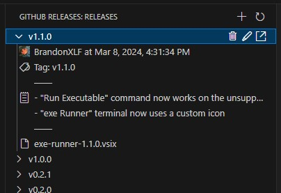
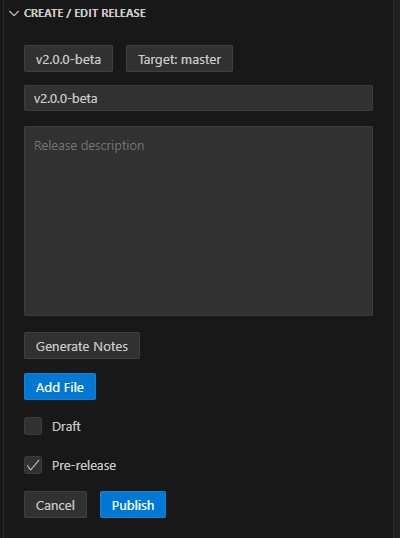

# GitHub Releases

View, create, and edit GitHub releases right from Visual Studio Code.

## Features

### Release Tree View

View releases from all git repositories with remotes on GitHub with a handy tree view in the activity bar.

For each release, information about the release and associated release assets can be shown. Actions are added to checkout the release's tag or to download release assets.

### Create and Edit Releases

Create new releases or edit exiting ones with an activity bar editor. The editor supports the creation of new tags as well as the creation, renaming, and deletion of release assets.

